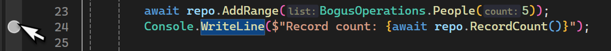
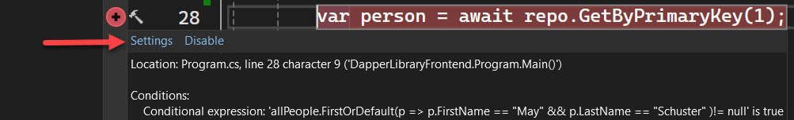
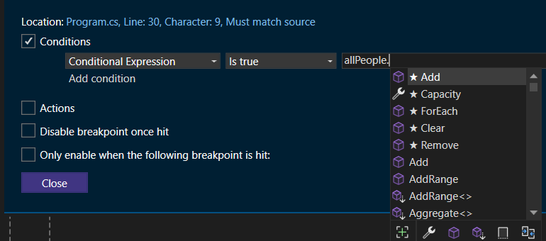

# About

## Namespaces
Use to demonstrate [namespaces](https://learn.microsoft.com/en-us/dotnet/csharp/fundamentals/types/namespaces) in code, in this case a class project containing all data operations and models (which are [classes](https://learn.microsoft.com/en-us/dotnet/csharp/fundamentals/types/classes)).

A model usually represents a table in a dataabase while a class performs work like read data into a model.

## Debugging tips

- To set a [breakpoint](https://learn.microsoft.com/en-us/visualstudio/debugger/using-breakpoints?view=vs-2022) with the keyboard press <kbd>F9</kbd> on a line of code to stop on.
- For mouse users, click in the gutter on the line of code to stop on as shown below. Clicking on the grey circle will turn to red.




- The two methods mentioned above will stop every time. You can also set conditional breakpoints which only stop on a specific condition.

Set a breakpoint, hover over the red dot and select `settings`.



Set a condition e.g. we want to break if a person's first name is May and last name is Schuster. 

When writing a condition like shown below Visual Studio provides what is known as intellisense. In this case type `allPeople.` presents a dropdown list of choices.



Next to get the breakpoint stop, check `Actions`, uncheck `Continue code execution`


```csharp
allPeople.FirstOrDefault(p => p.FirstName == "May" && p.LastName == "Schuster" ) is not null
```

## Disable a breakpoint by accident

You set a breakpoint with or without conditions and later click on the breakpoint rather than hover will remove the breakpoint.

To restore the breakpoint without closing the current tab, press <kbd>CTRL</kbd> + <kbd>Z</kbd>

## Documentation

Navigate through code by using the Visual Studio [debugger](https://learn.microsoft.com/en-us/visualstudio/debugger/navigating-through-code-with-the-debugger?view=vs-2022&tabs=csharp)

## Pluralsight

Karen's [recommendations](https://app.pluralsight.com/channels/details/645f3284-c561-497e-aa5f-cf352fcb5d7f?s=1)

