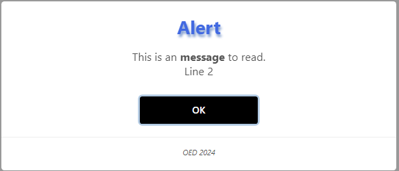
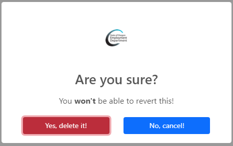

# About

- Replacements for browser alert and confirm dialogs which are in a JavaScript class that can be used in any project using [sweetalert](https://sweetalert2.github.io/) library.
- Shows setting H1 font-size as for many the font size is too large. Also haveing H1 assist with screen readers. And there should only be a single H1 on a page. The color is to show its possible to change the H1 color done in site.css
- Button style is different than most usages for Bootstrap and is only done to show what is possible.

## Events for confirmation button

For this session, an input element value is set, in a real application perhaps posting a form would be more realistic.

## Screenshots

They are a bit overboard only to show possibilities.

