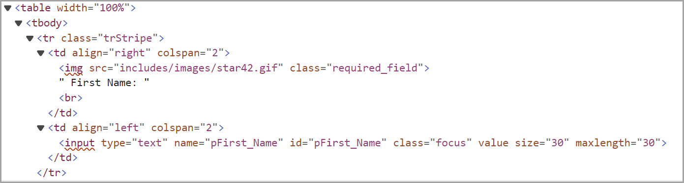
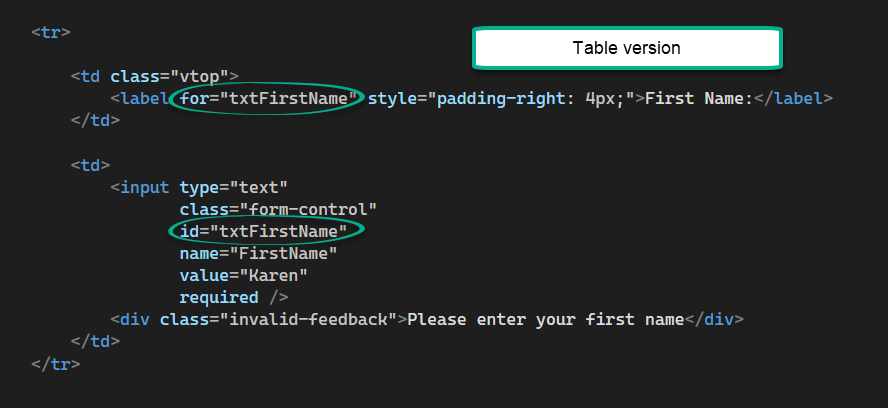
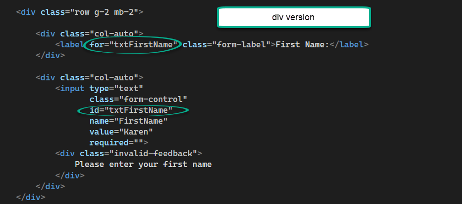
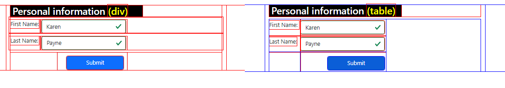

# About

Screen readers when presented with a table will announce rows/columns and if a label is not present for an input the person will have no idea what the inputs are for.



- In the first TD 
    - The image requires `alt text`
    - "First Name: " needs to be a label associated to `input` in the second TD for two reasons
        - Clicking on the label gives focus to the input
        - Screen readers will associate the label to the input


## Bootstrap

Two versions, first done with table, second with div.





## Bootstrap classes

:heavy_check_mark: :fleur_de_lis: :flushed: :wink: :raised_back_of_hand:


:heavy_check_mark: :fleur_de_lis: :wink: :raised_back_of_hand:


:fleur_de_lis: :heavy_check_mark: :wink: :flushed: :one: :two:

| Item        |   Description    |  :key: |
|:------------- |:-------------|:-------------|
| [Horizontal & vertical gutters](https://getbootstrap.com/docs/5.0/layout/gutters/#horizontal--vertical-gutters) | **.g-*** classes can be used to control the horizontal gutter widths, for the following example we use a smaller gutter width | :point_left:	 |
| row | Rows are `wrappers for columns`. Each column has horizontal padding (called a gutter) for controlling the space between them. This padding is then counteracted on the rows with negative margins. This way, all the content in your columns is visually aligned down the left side. |  |
|  | There are 12 template columns available per row, allowing you to create different combinations of elements that span any number of columns. Column classes indicate the number of template columns to span (e.g., col-4 spans four). width s are set in percentages so you always have the same relative sizing. |  |
| col-auto | Use col-{breakpoint}-auto classes to size columns based on the natural width of their content. | :point_left:	 |
|  |  |  |

## CSS Debugging

Using the following style sheet can assist when elements are not appearing as they should.

```css
* {
    outline: 1px solid red;
}

    *:hover {
        outline: 2px solid blue;
    }
```

And JavaScript

```javascript
document.addEventListener("DOMContentLoaded", () => {
    document.addEventListener('keydown', function (event) {

        if (event.key === '1' && event.altKey && event.ctrlKey) {
            $debugHelper.toggle();
        }

    });
});
```

Coparing index and index1



