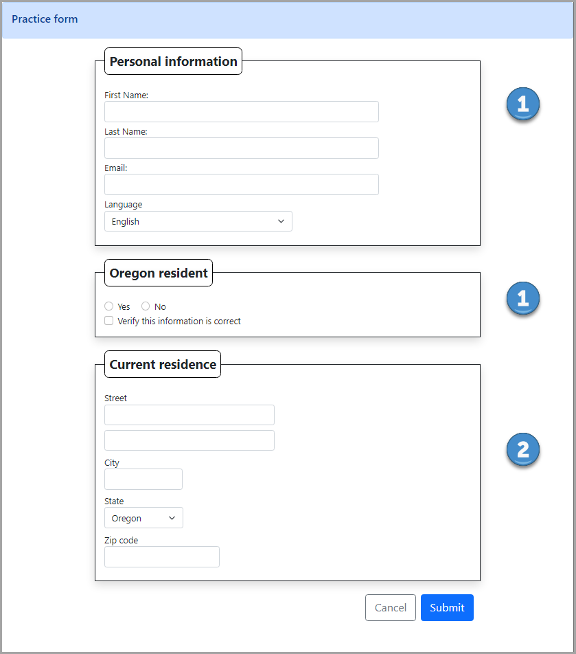
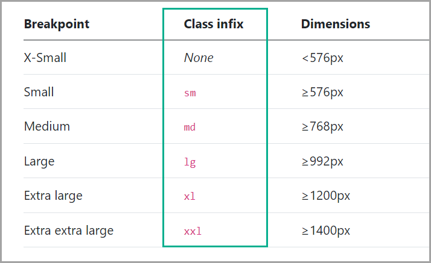

This is a basic form with common controls/elements to learn how to work with Bootstrap forms and responsive design. All styles are in site.css.

- Section (1) are setup with either w-75 Bootstrap 5 class to take up 75% of the container or using Bootstrap class col-auto which takes up space needed to display a select element.
- Section (2) uses Bootstrap classes col-lg-6, col-lg-3, col-lg-2 and col-auto to better control sizes of elements.

## Bootstrap

The follow are core aspects for working with Bootstrap 5. Note that we can move backwards to Bootstrap 4 but need to use different classes, for instance `ms` for Bootstrap 4 is `ml` which are both for margin left.

### Bootstrap 5 Grid system

Is comprised of a 12 column grid. The grid supports [six responsive breakpoints](https://getbootstrap.com/docs/5.0/layout/breakpoints/).

**Breakpoints** are the building blocks of responsive design. Use them to control when your layout can be adapted at a particular viewport or device size.

Each breakpoint was chosen to comfortably hold containers whose widths are multiples of 12. Breakpoints are also representative of a subset of common device sizes and viewport dimensions—they don’t specifically target every use case or device. Instead, the ranges provide a strong and consistent foundation to build on for nearly any device.

### Spacing

Bootstrap includes a wide range of [shorthand responsive](https://getbootstrap.com/docs/5.0/utilities/spacing/) margin, padding, and gap utility classes to modify an element’s appearance.
