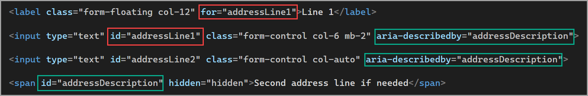

# About

This project contains examples for associating a `label` to another element such as `input`, `radiobutton`, `checkbox`, `select` etc.

---

## Assistance

There may be situations that don’t fit into any of the examples presented. If this happens don’t hesitate to call Karen in a team meeting, explain what is not working and present your screen so we can work out the issue.

---

## Use of BootStrap

In some examples, BootStrap library is used, ignore this as what is shown works with or without BootStrap.

---

## Syntax

No matter the input type, the input must have an `id` (identifier) attribute and has a label element with a `for` attribute that points to an input. In the following example the input `id` is firstName which is associated with a label element using a `for` attribute.

When working with tables (table-tr-td) it does not matter if the input and label are not in the same row and/or in the same row/column. 

What matters is the for attribute of a label points to an existing input with the id used in the for attribute of the label.

What if an input does not have an `id`, assign an `id`, make sure the `id` is unique and add a comment in code about adding the `id`.

---

## Examples

| Page        |   Description    |   Comments |
|:------------- |:-------------|:-------------|
| inputElements.html | Shows how to setup a label associated with an input for first and last name. |  |
| radioCheckButtons.html | This page shows how to associate check box and radio button with a label | CheckBoxes and RadioButton  |
| selectElement.html | Demonstrates associating a label to a select element |  |
| multipleInputsOneLabel | One label multiple inputs |  |
| inputExperiment.html | :small_orange_diamond: | Karen's experiments |
|  |  |  |

## Exceptions to the above rules

When encountering situations like an address with multiple inputs (line1 and line2) and one label as shown below.

*(ignore the bordered element know as a fieldset/legend)*

There are two options

1. Set the label to the first input
1. Utilize [aria-describedby](https://developer.mozilla.org/en-US/docs/Web/Accessibility/ARIA/Attributes/aria-describedby) which in association with a hidden span, screen readers will read the text in the span. For those not visually impaired can figure out what the second line is for. The proper way would be to have one label per input but for the current task we are not going there.

## Testing

Once a page has been completed, view the page, click on each label to ensure focus is set to the proper input.