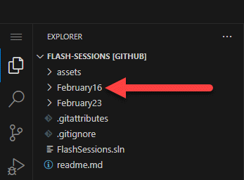
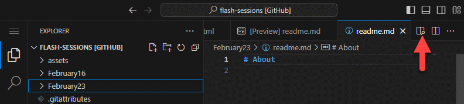

## Project code

All projects are language agnostic, meaning not attached to ASP.NET Core, PHP, Cold Fusion etc. All .html files can be used by double clicking a file from Windows Explorer.

## Experimenting with code

Open Microsoft Visual Code to the repository folder on your laptop. You can view the code, edit it then open in a browser or use the following Visual Code [extension](https://marketplace.visualstudio.com/items?itemName=ritwickdey.LiveServer) which I will go over in a future flash session which permits viewing a page in a browser, make a change in VS Code, press <kbd>CTRL</kbd> + <kbd>S</kbd> and see changes in the browser without pressing <kbd>F5</kbd>.

## Where was the code written

Using Microsoft Visual Studio 2022 but could had been done in Microsoft Visual Studio Code.

## To view code online

Traverse to the repository type a `.` which opens the [web version of Microsoft Visual Code](https://code.visualstudio.com/docs/editor/vscode-web). 

Let's say you would like to view code in the project February16.

Single click on February16, the project folder expands. Do the same for the folder `wwwroot` then `js` and to then view the file SweetDialogs.js single click

## What not to view

Files under wwwroot/lib/bootstrap which you can but makes no sense as these are third party code, nothing to learn from.

## .md files

If they display raw (you see code not as seen say as a HTML page), click on the link pointed to below.

